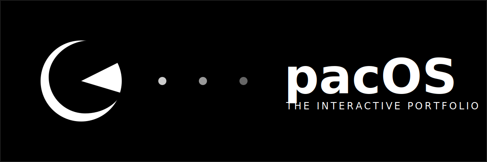
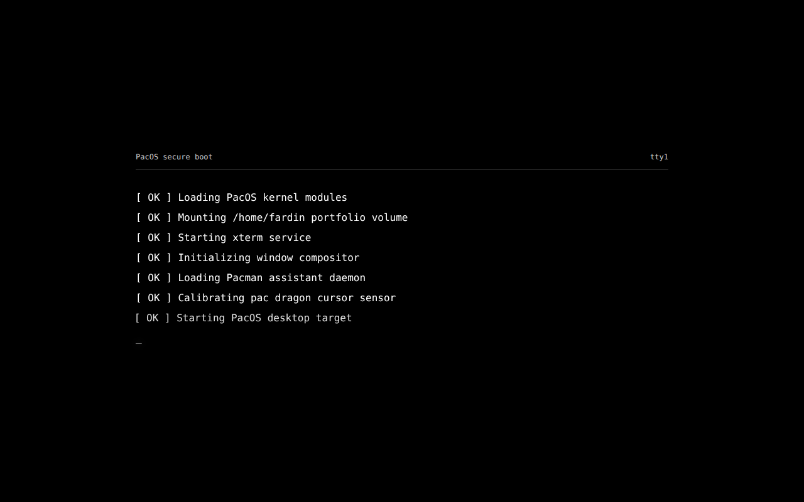
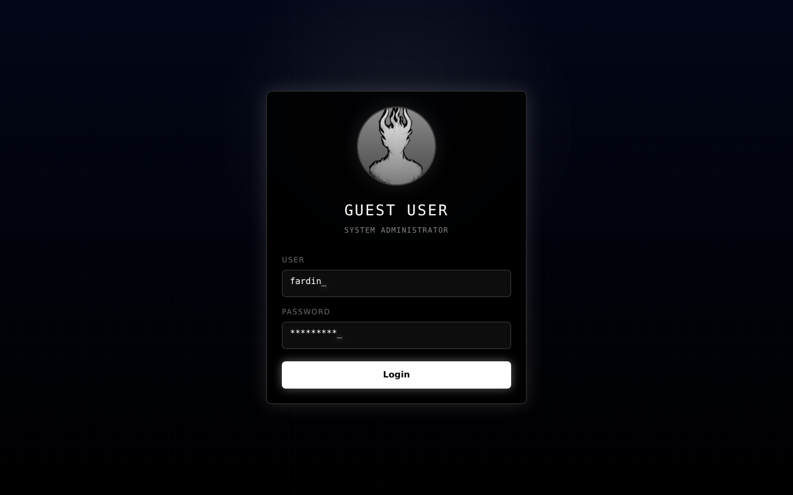
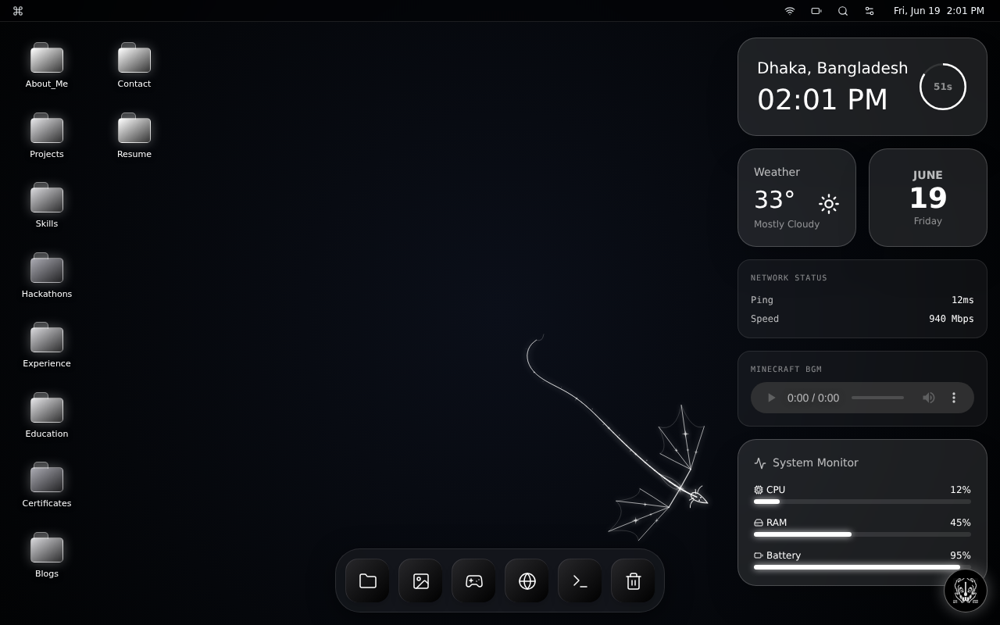

# 🕹️ pacOS Portfolio

<p align="center">
  
</p>

**pacOS** is an immersive, interactive browser-based operating system portfolio built for Fardin. Instead of presenting projects as a normal scrolling website, it transforms the portfolio into a full desktop environment complete with a cinematic boot sequence, login screen, draggable windows, and a functional terminal.

<p align="center">
  
</p>

## 🌟 Highlights

- **🕹️ Retro OS Experience**: A complete browser-based desktop environment with a functional Dock, Menu Bar, and window management system.
- **⚡ Cinematic Sequence**: Engaging boot-up and login process that sets the stage for a unique user experience.
- **📁 Structured Portfolio**: Explore projects, skills, experience, and education through a familiar folder and file system.
- **🤖 Pacman Assistant**: An intelligent AI-driven assistant that helps visitors navigate and answers questions about the portfolio.
- **📟 Interactive Terminal**: A fully functional shell (powered by xterm.js) supporting commands like `help`, `neofetch`, `ls`, and more.
- **🎮 Built-in Arcade**: Play classic games like Snake, Tetris, Minesweeper, and 2048 directly within the OS windows.
- **📈 Live Widgets**: Real-time system monitor, weather, clock, and network status widgets on the desktop.
- **🌌 Dynamic Environment**: Animated wallpapers, sound effects, toast notifications, and a "dragon" cursor assistant.

## 🖼️ Screenshots

| Boot Sequence | Login Screen |
| :---: | :---: |
|  |  |

### The Desktop

*A look at the interactive desktop with folders and live widgets.*

---

## 🛠️ Tech Stack

| Frontend | State & Animation | Utilities |
| :--- | :--- | :--- |
| **React** (Framework) | **Zustand** (State) | **Lucide React** (Icons) |
| **TypeScript** (Language) | **Framer Motion** (Animations) | **xterm.js** (Terminal) |
| **Vite** (Build Tool) | **Tailwind CSS** (Styling) | **Standard Web APIs** |

## 🏗️ Project Architecture

```text
src/
  ├── apps/             # App registry and metadata
  ├── components/       # Desktop elements, Dock, Widgets, Boot/Login
  ├── core/             # Types and core logic
  ├── files/            # Portfolio content and file system structure
  ├── games/            # Interactive game components
  ├── pacman/           # AI Assistant implementation
  ├── store/            # Zustand state management (PacStore)
  ├── terminal/         # pacOS Terminal (xterm.js integration)
  ├── windowManager/    # Window layers and frame logic
  └── windows/          # Application-specific window content
```

## 📜 Ownership and Usage

**Copyright (c) 2026 Fardin. All rights reserved.**

This project is proprietary. The source code is made available for review, hiring, and collaboration purposes only. You may not redistribute, sell, or reuse the core design and logic in other projects without explicit permission.

---

<p align="center">
  Built by Fardin FN
</p>
